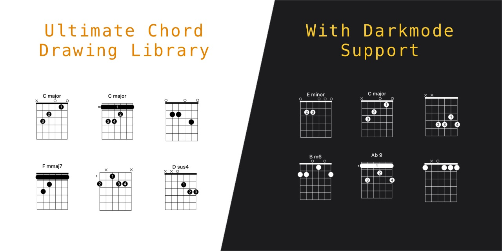

# Swifty Guitar Chords


This is a Swift library that can generate CAShapeLayers for any chord within it's database. All you need to do is supply a Key (C, C#, etc) and a suffix (Major, Minor, sus4, etc) to find the appropriate chord. Each chord comes with a few variants. 

The database is pulled from another project I found a while ago, but cannot remember where that was. Please do not rely 100% on this data, as I have found that a few chords are incorrect. If you find any of your own, please open a PR correcting these.

> This library is currently in Beta. Everything works, and the drawing speeds are fine, but there is lots of room for improvement.

I am using this library in my music study app "Mustud" with no problems at all.

## Requirements
- iOS 13+
- Xcode 11+

## Installation
Only supports Swift Package Manager at this time.

# Usage

## Search

#### Get all Chords

```
GuitarChords.all
```

#### Filter by Key
Returns all chords based on C

```
GuitarChords.all.matching(key: .c)
```

#### Filter by Suffix
Returns all major chords in the database.

```
GuitarChords.all.matching(suffix: .major)
```

#### Filter by Key and Suffix
Returns all CMajor chords. 
These will be in order of position on the fretboard, starting at the nut.

```
GuitarChords.all.matching(key: .c).matching(suffix: .major)
```

## Drawing
There are a number of ways to use the CAShapeLayer. You can add it directly to a view, or convert it to a UIImage.

Image from layer extension is as follows, and is not present in the library:

```
extension CALayer {

    func imageFromLayer() -> UIImage? {
        UIGraphicsBeginImageContextWithOptions(self.frame.size, self.isOpaque, 0)

        defer { UIGraphicsEndImageContext() }

        guard let context = UIGraphicsGetCurrentContext() else {
          return nil
        }

        self.render(in: context)
        return UIGraphicsGetImageFromCurrentImageContext()
    }

}
```

To use it, we just need a chord!

```
let chordPosition = GuitarChords.all.matching(key: .c).matching(suffix: .major).first!
let frame = CGRect(x: 0, y: 0, width: 100, height: 150)
let layer = chordPosition.layer(rect: frame, showFingers: true, showChordName: true, forScreen: true)
imageView.image = layer?.imageFromLayer()
```

### Arguments
`frame` is the size of the shape layer. The size of your chord.

`showFingers` set this to true if you want the finger positions to be drawn on each note.

`showChordName` set this to true if you want the chord name displayed. You may want to hide this if you were building a flashcard or chord quiz app.

`forScreen` This is for dark mode support. Set it to false if you want it to always be drawn with a white background and black text (ideal for printing).